## Exercise 3: Create an Azure Files Share for FSLogix

Duration:  90 minutes

In this exercise, you will be creating an Azure File share and enabling SMB access via Active Directory authentication. Azure Files is a platform service (PaaS) and is one of the recommended solutions for hosting FSLogix containers for AVD users. At the end of this exercise, you will have the following components:

-   A new storage account in your Azure subscription.

-   A new Azure file share for your FSLogix profile containers.

-   AD authentication enabled for your Azure storage account.

-   Permissions applied for user access to the file share.

**Additional Resources**

  |              |            |  
|----------|:-------------:|
| Description | Links |
| Windows File Server |https://docs.microsoft.com/en-us/azure/virtual-desktop/create-host-pools-user-profile| 
|NetApp Files|https://docs.microsoft.com/en-us/azure/virtual-desktop/create-FSLogix-profile-container |
|Azure Files | https://docs.microsoft.com/en-us/azure/virtual-desktop/create-profile-container-adds |
|              |            |

### Task 1: Create a storage account

Before you can work with an Azure file share, you need to create an Azure storage account. To create a general-purpose v2 storage account in the Azure portal, follow these steps:

1.  In the Azure Portal, type **storage accounts** in the **Search resources** field. Select **Storage accounts** from the list.

    

2.  On the Storage Accounts window that appears, select **+ Add**.

    

3.  Fill in the required parameters for the storage account as given below:

  - Subscription: *Select the default subscription*. 
   
  - Resource Group: *Select **AVD-RG** from the drop down*. 
   
  - Storage account name: **<inject key="Storage Account Name" />**   
      
  - Region: **East US**, *this should be the same as the location of your resource group*.  
   
  - Performance: **Standard**   
      
  - Redundancy: **Locally-redundant storage (LRS)**
   
  - Click on **Review**

    

4. At last, Select **Create**.

5. Once the deployment is ready, select **Go to resource**. This will take you to the storage account you just created.

   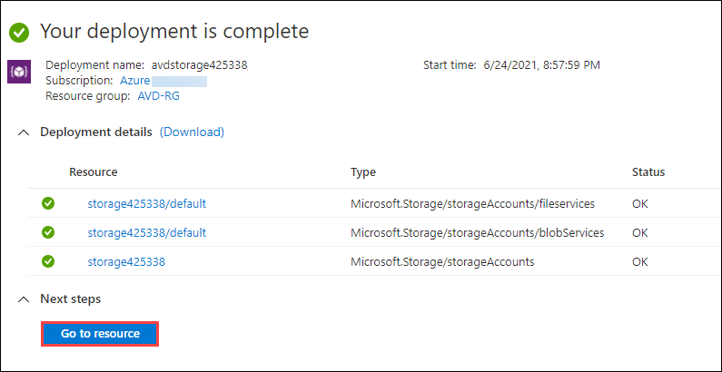

### Task 2: Create an Azure file share 

1.  On the **storage accounts** page, select **File shares** and select **+ File Share**.

    

2.  Enter a Name it as **avafiles** for the new file share, select **Hot** Tier and select **Create**.

    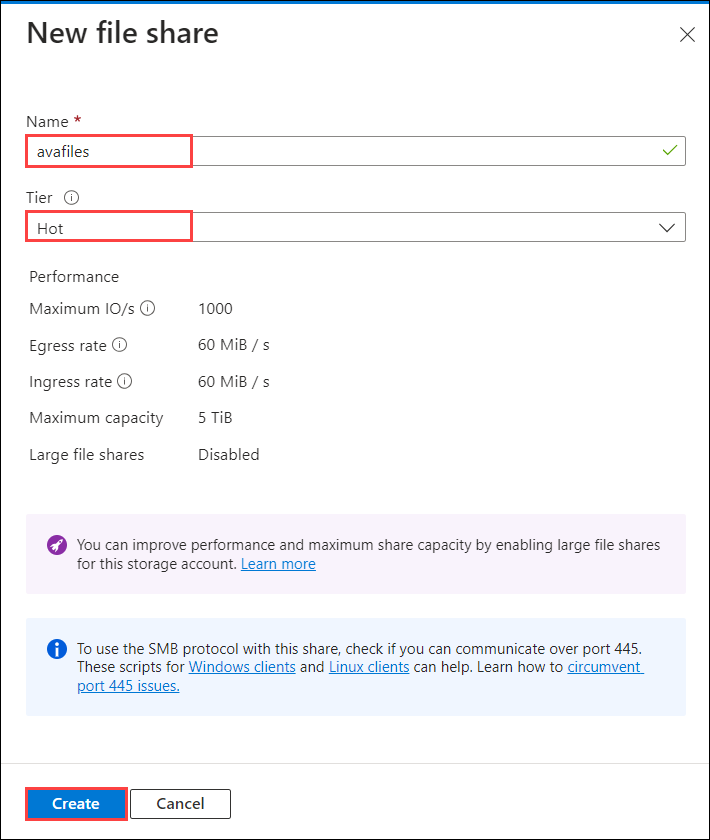
    
> **Note**: The file share quota supports a maximum of 5,120 GiB and can be managed on the File shares blade.

### Task 3: Enable AD authentication for your storage account

**Prerequisites**

1.  The steps in this task need to be completed from a domain joined computer. The **AzFilesHybrid** module uses the AD PowerShell module, so running from a server is preferred.

    

2.  The account used in this task needs to meet the following requirements:

    -    Synchronized with Azure AD.

    -    Permissions to create user or computer objects in Active Directory.

    -    Owner or Contributor rights on the Storage account.

In this task, you will be completing the steps on the Domain Controller in Azure using an account that has been assigned Global Administrator and Domain Administrator. In a production environment, you can scale this back if you meet the minimum requirements above.

**Setup**

1.  From a domain joined computer, download, and unzip the [AzFilesHybrid module](https://github.com/Azure-Samples/azure-files-samples/releases).

    **Link address**: https://github.com/Azure-Samples/azure-files-samples/releases   

    

2. From the GitHub repository, select and download the AzFilesHybrid.zip file to the domain joined computer **Documents** folder.

    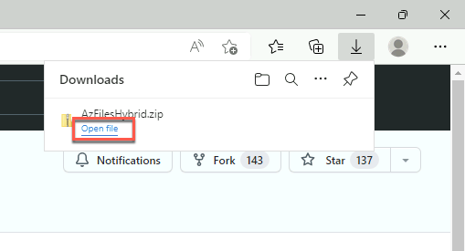

3. Extract this file to the **Documents** folder on the local Domain controller.

    

5. Set the path to **C:\Users\ADAdmin\Documents\AzFilesHybrid** and select **Extract**.

    

6. Open an elevated PowerShell ISE window by finding the **PowerShell ISE** icon on the desktop. Right-click on the icon and select **Run as administrator**.

    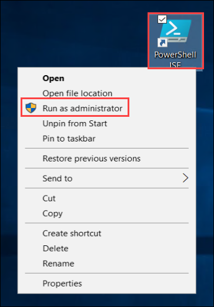

7. Configure the PowerShell execution policy **Unrestricted** for the current user. Select **Yes to All** on **Execution Policy Change** popup.

    ```
     Set-ExecutionPolicy -ExecutionPolicy Unrestricted -Scope CurrentUser
    ```

8. Navigate to where you unzipped the AzFilesHybrid.

    ```
    cd C:\Users\ADAdmin\Documents\AzFilesHybrid
    ```

    

9. Install the Az PowerShell module. Select **Yes** on **NuGet provider is required to continue** popup and select **Yes to All** on **Untrusted Repository** popup.

    ```  
    if ($PSVersionTable.PSEdition -eq 'Desktop' -and (Get-Module -Name AzureRM -ListAvailable)) {
    Write-Warning -Message ('Az module not installed. Having both the AzureRM and ' +
      'Az modules installed at the same time is not supported.')
    } else {
    Install-Module -Name Az -AllowClobber -Scope CurrentUser
    }
    ```

10. Install the AzFilesHybrid module. Select **Run Once** on **Security warning** popup.

    ```
    .\CopyToPSPath.ps1
    ```

11. Import the AzFilesHybrid module. Select **Run Once** on **Security warning** popup and select **Yes to All** on **Install updated version of PowerShellGet** popup.

    ```  
    Import-Module -Name AzFilesHybrid
    ```

    
    
12. Sign in with your account using the credentials given below:
  * Username: **<inject key="AzureAdUserEmail" />**
  * Password: **<inject key="AzureAdUserPassword" />**

      ```
      Connect-AzAccount
      ```

13.  Create the following PowerShell variables replacing the subscription-id with the <inject key="Subscription ID" enableCopy="true"/>, resource group name, and storage-account-name with the <inject key="Storage Account Name"  enableCopy="true"/> information specific to your lab environment:

      ```
      $SubscriptionId = "<subscription-id>"
      $ResourceGroupName = "AVD-RG"
      $StorageAccountName = "<storage-account-name>"
      ```
  
      

      > **Note**: The Resource Group Name and Storage Account Name were assigned in Task 1.
  
      > **Note**: You can run Get-AzSubscription to look up the available subscription names.

14.  Select the target subscription for the current session.

      ```
      Select-AzSubscription -SubscriptionId $SubscriptionId    
      ```

15. Register the storage account with your Active Directory domain. Select **Run Once** on the **Security warning** popup.

    ```
    Join-AzStorageAccount -ResourceGroupName $ResourceGroupName -StorageAccountName $StorageAccountName
    ```

    

17. When the script completes, you will get a similar output.

    

18. Confirm the object was created successfully in **Active Directory Users and Computers** by going to Domain controllers and looking for the computer object for Azure storage account.

    

19. Confirm that the feature is enabled.

    ```
    $storageaccount = Get-AzStorageAccount -ResourceGroupName $ResourceGroupName -Name $StorageAccountName
    ```

20. List the directory service of the selected service account.

    ```
    $storageAccount.AzureFilesIdentityBasedAuth.DirectoryServiceOptions
    ```

21. List the directory domain information if the storage account has enabled AD authentication for file shares.

    ```
    $storageAccount.AzureFilesIdentityBasedAuth.ActiveDirectoryProperties
    ```

    


22. Confirm activation with your domain by navigating to the Azure portal, going to the storage account and selecting Files shares under Data storage. Refer to the File share settings to see Configured on Active Directory (AD), as shown in the example below.

    >**Note:** You may need to navigate out of the storage account and back in for the File share settings to change.

     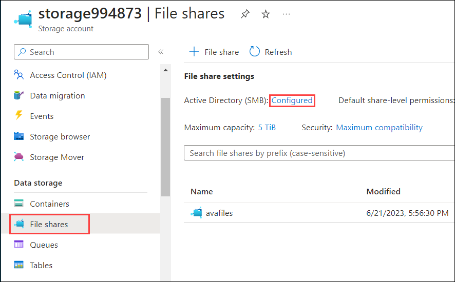

You have now successfully enabled AD authentication over SMB and assigned a custom role that provides access to an Azure file share with an AD identity.

### Task 4: Configure share permissions

There are three Azure built-in roles for granting share-level permissions to users and/or groups:

-   **Storage File Data SMB Share Reader**: allows read access in Azure Storage file shares over SMB.

-   **Storage File Data SMB Share Contributor**: allows read, write, and delete access in Azure Storage file shares over SMB.

-   **Storage File Data SMB Share Elevated Contributor**: allows read, write, delete, and modify NTFS permissions in Azure Storage file shares over SMB.

To access Azure Files resources with identity-based authentication, an identity (a user, group, or service principal) must have the necessary permissions at the share level. This process is similar to specifying Windows share permissions, where you specify the type of access that a particular user has to a file share. The guidance in this task demonstrates how to assign read, write, or delete permissions for a file share to an identity.

To simplify administration, create 4 new security groups in Active Directory to manage share permissions.

1.  From the domain joined computer, go to **Local Server** and open **Active Directory Users and Computers** from **Tools**. Then navigate to **contoso.com > Builtin** and select the **Create a new group in the current container** icon. 

    

2.  Create the following Active Directory security groups in an OU that is synchronized with Azure AD:

    -   **AZF FSLogix Contributor**

        

    -   **AZF FSLogix Elevated Contributor**

        

    -   **AZF FSLogix Reader**

        

    -   **AVD Users**

        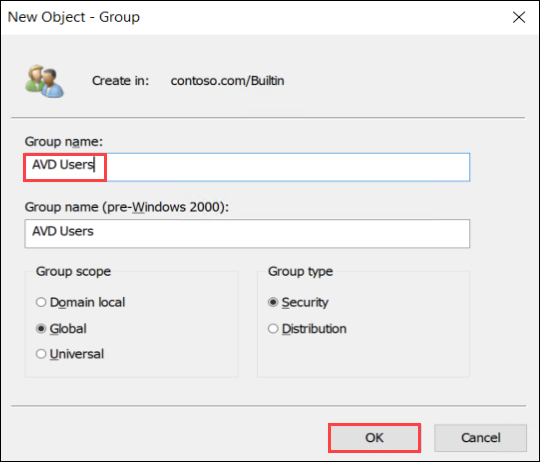
        
    - **AVD App Hosts**

        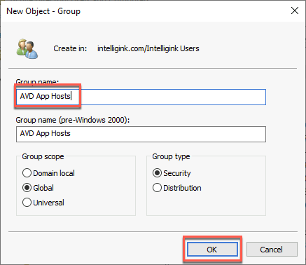

3.  Add the AVD administrative account that you created previously to the group AZF FSLogix Elevated Contributor. This account will have permissions to modify file share permissions.

    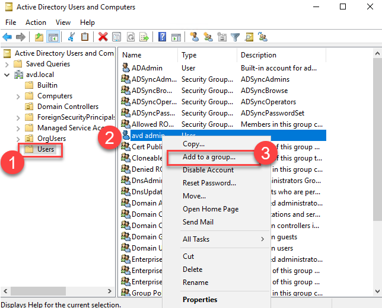

4.  Type **AZF FSLogix Elevated Contributor** and select **Check Names** to verify. Select **OK** to save.

    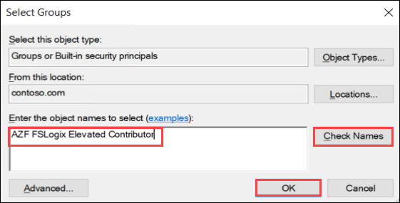

5.  Add the group **AVD Users** to the group **AZF FSLogix Contributor**. Go to the **Builtin** groups, locate **AVD Users** and right-click to **Add to a group**.
  
    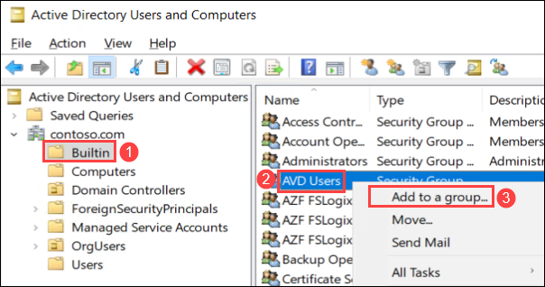

6. Type **AZF FSLogix Contributor** and select **Check Names** to verify. Select **OK** to save.

    

7.  Add user accounts to the **AVD Users** group. Open **OrgUsers**, select all the users and right-click on **Add to a group**. These users will have access to use FSLogix profiles.

    

8. Type **AVD Users** and select **Check Names** to verify. Select **OK** to save.

    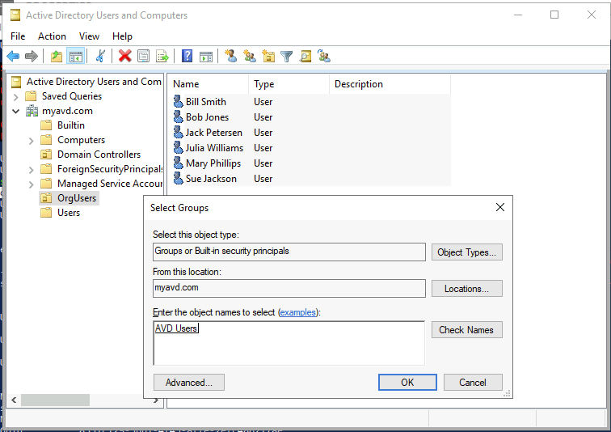

9.  Wait for the new groups to synchronize with Azure AD.  These groups can be verified by going to **Groups** within **Azure Active Directory** and looking for the names in the list.

    

    With the new security groups available in Azure AD, use the following steps to assign them to your storage account in the Azure portal. This will enable to manage share permissions using AD security groups.

10. In the Azure portal, in the **Search resources** field, type **storage accounts** and select **Storage accounts** from the list.

    

11. On the Storage accounts blade, select the Storage account **<inject key="Storage Account Name" />**. 

    

11. On the blade for your storage account, locate and select **File shares**. Then, on the File shares blade, select your file share.

    

12. Select **Access Control (IAM)**, and then select **+ Add** and select **Add role assignment**.

    

13. On the Add role assignment page, search for and select **Storage File Data SMB Share Contributor** and select **Next**.

    

14. Select **+Select members** and add the **AZF FSLogix Contributor** and **AVD App Hosts** group. Select the **Select** button and then select **Review + assign** and **Review + assign** again.

    

15. Repeat steps 12 - 14 for the remaining two roles.

    - Storage File Data SMB Share Elevated Contributor \> AZF FSLogix Elevated Contributor

    

    - Storage File Data SMB Share Reader \> AZF FSLogix Reader

    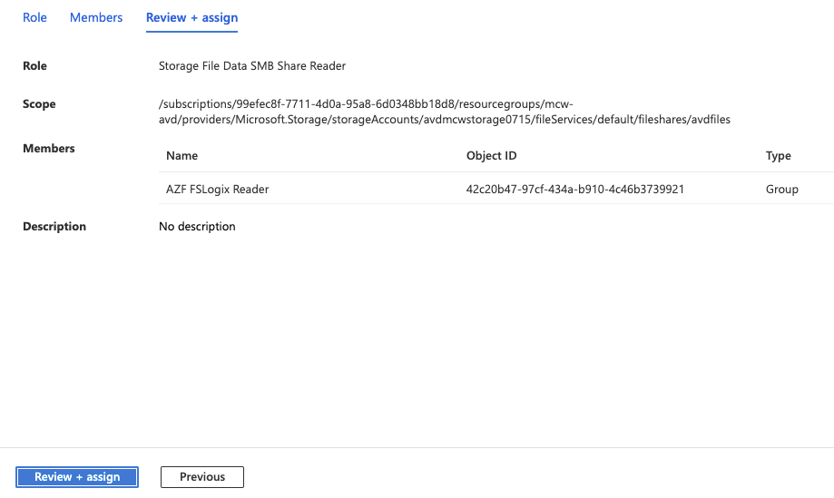

### Task 5: Configure NTFS permissions for the file share

After you assign share-level permissions with Azure RBAC, you must assign proper NTFS permissions at the root, directory, or file level. Think of share-level permissions as the high-level gatekeeper that determines whether a user can access the share. Whereas NTFS permissions act at a more granular level to determine what operations the user can do at the directory or file level.

Azure Files supports the full set of NTFS basic and advanced permissions. You can view and configure NTFS permissions on directories and files in an Azure file share by mounting the share and then using Windows File Explorer or running the Windows iCACLS or Set-ACL command.

The first time you configure NTFS permission, do so using superuser permissions. This is accomplished by mounting the file share using your storage account key.

1. Firstly, you will need to disable secure transfer in the storage account.  Navigate to the storage account and select **Configuration**. Then select **Disabled** under **Secure transfer required** and at last, select **Save** to save the changes.

    

2. Now select **File shares** given in the left pane, under **Data Storage** and open the file share you created earlier.

    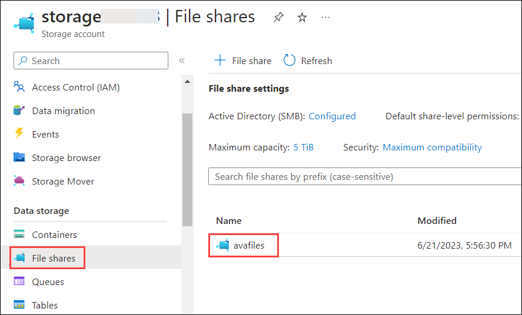

3.  On the blade for the file share within your storage account, select **Connect**. This will open the **Connect** blade. 

    

    >**Note**: The base URL is also available under the **Properties** of the storage account under the **File service** entry.  

4. On the **Connect** blade, select Drive letter **Z**, **Storage account key** for the Authentication method, and click on **Show Script**. 

    

5. On the **Connect** blade for your storage account, copy the **PowerShell** script located in the gray text box.

    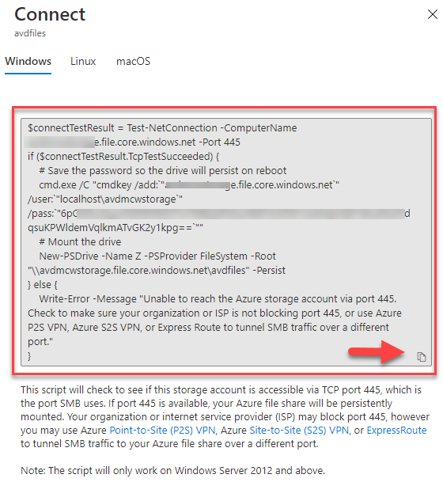

6. From a domain joined computer, open **PowerShell**, and paste the **PowerShell** script that you copied from the **Connect** blade. 

    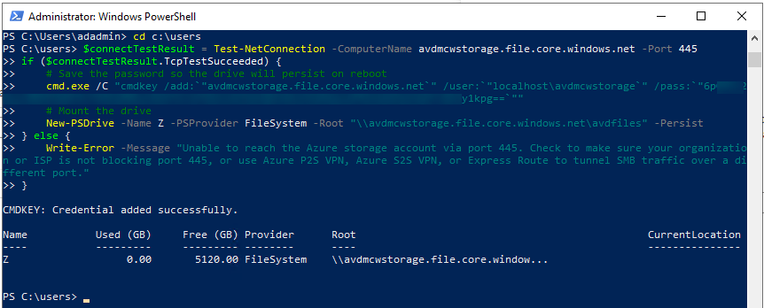

    >**Note**: After running the script, if you receive a CMDKEY: Credential added successfully and drive name **Z** appears, the script has run correctly. If this fails, it may be that this is an SMB connection on port 445, and many consumer ISPs block this port by default. When doing this in your lab and experiencing issues mounting the share from a local computer, try connecting from a domain-joined VM in Azure. 

    

7. Open **File Explorer**, right-click on the **Z:** drive, and select **Properties**.

8. On the properties window, select the **Security** tab and select **Advanced**.

    

9. Select **Add** and add each of the AD security groups below with the appropriate permissions, you can only add one at a time. Select check names as each are entered to verify the connection.

    | AD Group | NTFS Permissions | Applies to |
    |----------|------------------|------------|
    | **AZF FSLogix Contributor** | Modify | This folder, subfolders and files|
    | **AZF FSLogix Elevated Contributor** | Full control |This folder, subfolders and files|
    | **AZF FSLogix Reader** | Read & execute |This folder, subfolders and files|
    | **AVD Users** | Modify (This folder only) |This folder only|
    | **AVD App Hosts** |	Modify |	This folder, subfolders, and files|

> **Note**: Only one group can be added at a time, so add one and then repeat the process until all four are added.

  * **AZF FSLogix Contributor**

     

  * **AZF FSLogix Elevated Contributor**

     

  * **AZF FSLogix Reader**

     

  * **AVD Users**

     
   
  * **AVD App Hosts**

     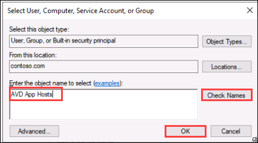

10. Select **OK** to save your changes. Select **Yes** if you receive a **Windows Security** warning about removing inherited permissions.

    

### Task 6: Configure NTFS permissions for the containers

With the NTFS permissions applied at the root file share, you can now create the FSLogix folder structure and recommended NTFS permissions. There are many ways to create secure and functional storage permissions for use with Profile Containers and Office Container. Below is one configuration option that provides new-user functionality and doesn't require users to have administrative permissions.

In this task we will create directories for each of the FSLogix profile types and assign the recommended permissions.

1.  Navigate to the networked drive in File explorer.

    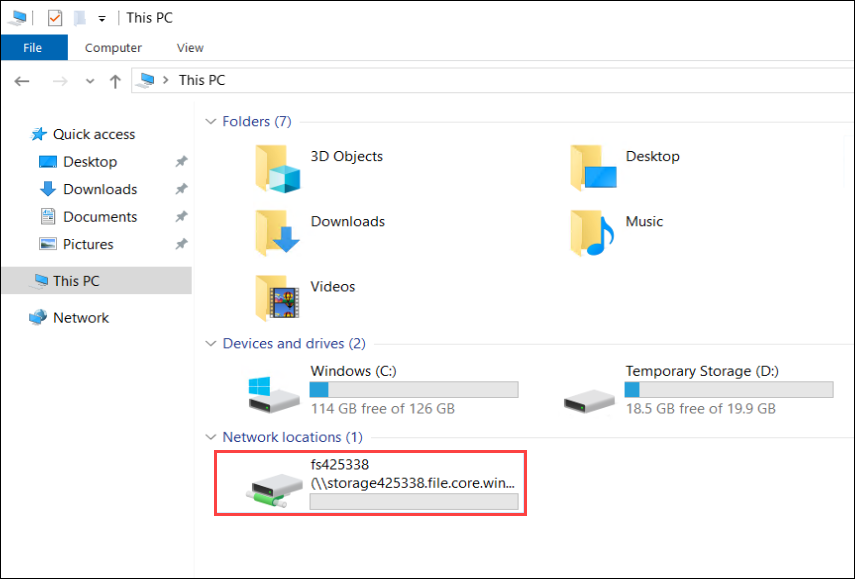

2.  Create three new folder directories in the root share as give below:

  * **Profiles**
  * **MSIX**

    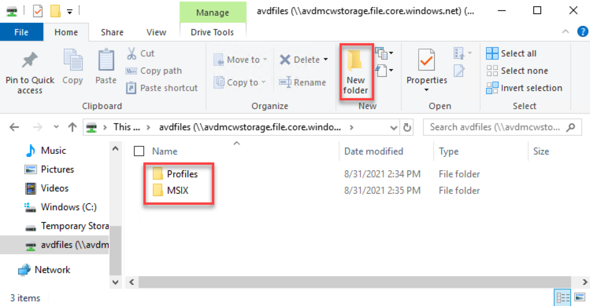

3.  Right-click on the **Profiles** folder directory and select **Properties**. 

    

4.  On the properties window, select the **Security** tab and select **Advanced**.

    

5.  Select **Disable inheritance** and select **Remove all inherited permissions from this object**.

    

6.  Select **Add** and then select **Select a principal**.

      

7. Add **AZF FSLogix Elevated Contributor** group and select **Check Names** then select **OK**.
    
    

8. Grant **Full Control** by selecting the **Full Control** check box and check **Only apply these permissions to objects and/or containers within this container**, then Select **OK**.

    

9.  Select **Add** and then select **Select a principal**. Add **Creator owner** group and select **Check Names** then select **OK**.

    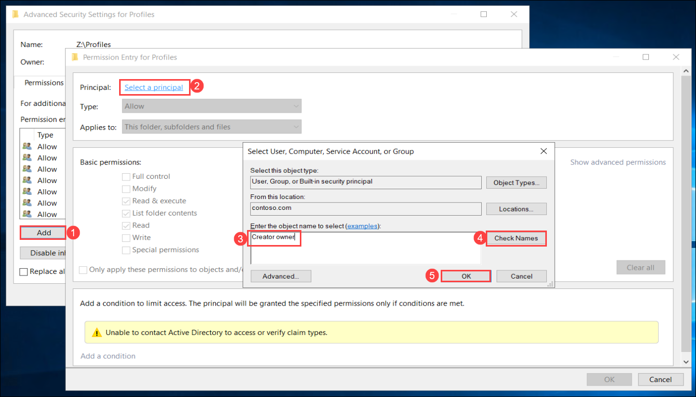

10. Grant **Full Control** by selecting the **Full Control** check box and check **Only apply these permissions to objects and/or containers within this container**, then Select **OK**.

    

11. Select **Add** and then select **Select a principal**. Add **AVD Users** and select **Check Names** then select **OK**.

    

12. Select **Show advanced permissions** and grant the following special permissions to **Only apply these permissions to objects and/or containers within this container** and then select **OK**. 

    * Traverse folder / execute file
    * List folder / read data
    * Read attributes
    * Create folders / append data

      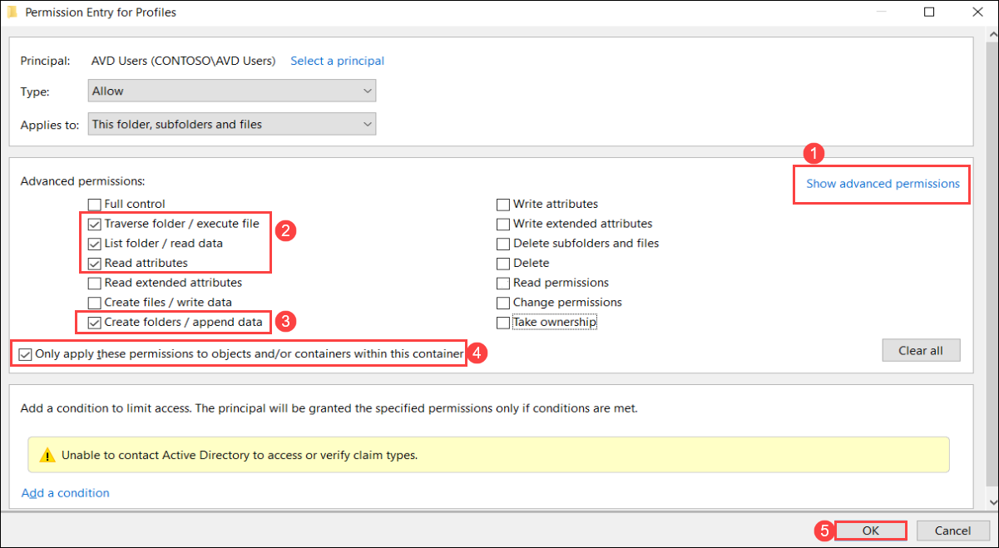

13. Select **OK** on both property windows to apply your changes.

    

14. Once done, then right-click on the **MSIX** directory and select **Properties**. 

    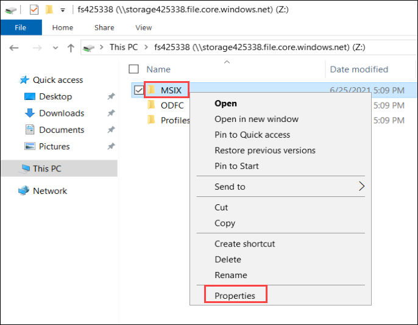

15. On the properties window, select the **Security** tab and select **Advanced**.

16. Select **Disable inheritance** and select **Remove all inherited permissions from this object**.

    

17. Select **Add** and then select **Select a principal**.

    

18. Select **Add** and add **AZF FSLogix Elevated Contributor**. Grant **Full Control** to **Only apply these permissions to objects and/or containers within this container**. Select **OK**.

    

19. Select **Add** and add **AVD Users**. Grant **Read & execute** to **Only apply these permissions to objects and/or containers within this container**. Select **OK**.

    

20. Repeat the step above for **AVD App Hosts**.

21. Confirm your permissions match the screenshots below.

    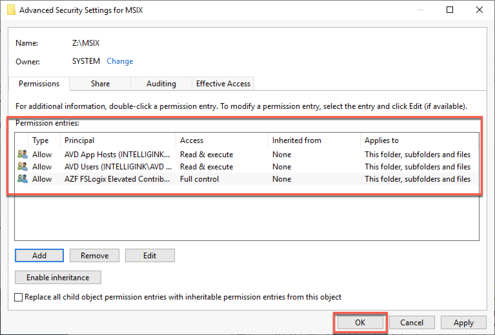

22. Select **OK** on both property windows to apply your changes.

23. Click on the **Next** button present in the bottom-right corner of this lab guide.
