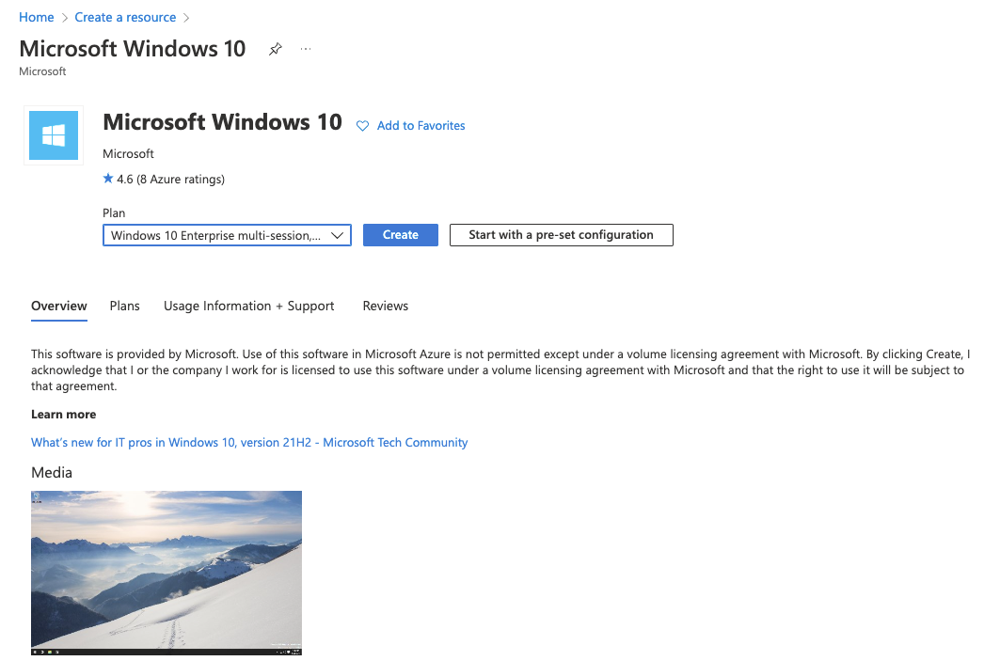
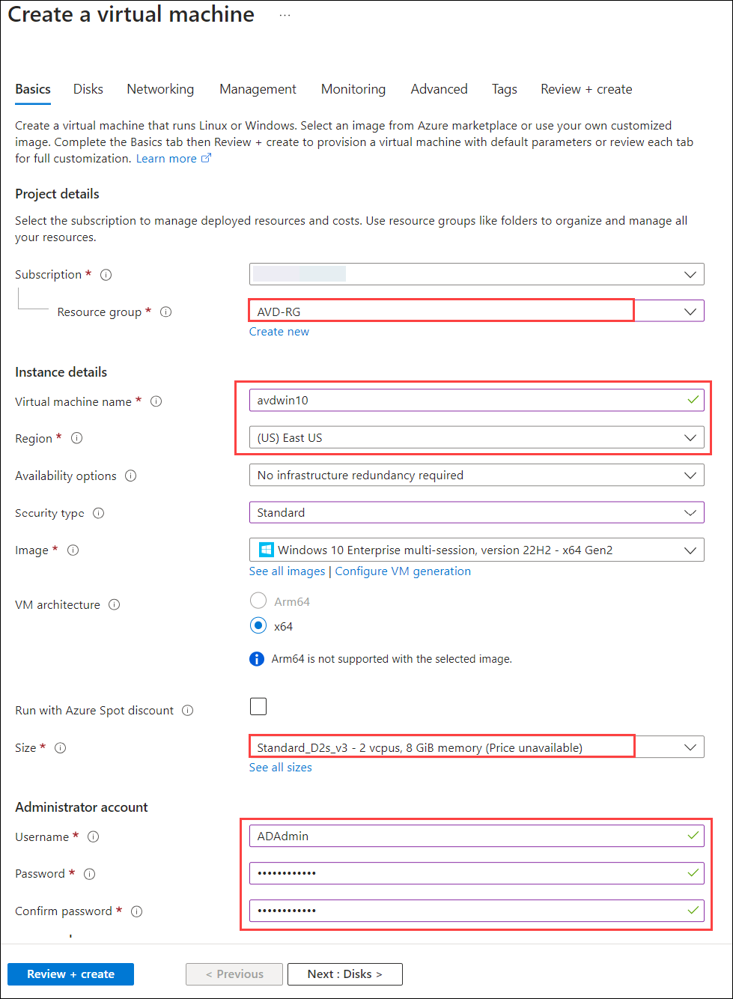
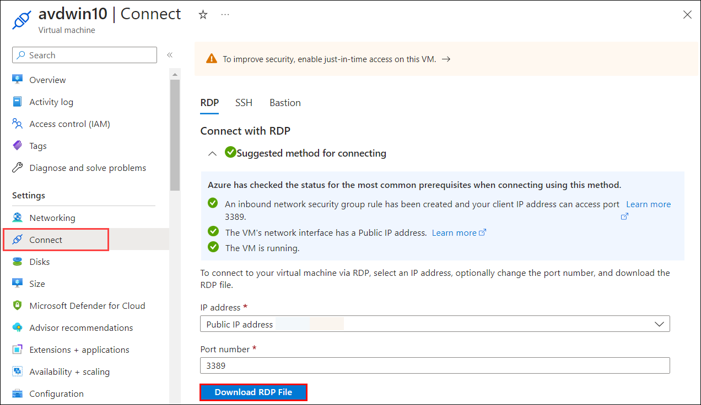
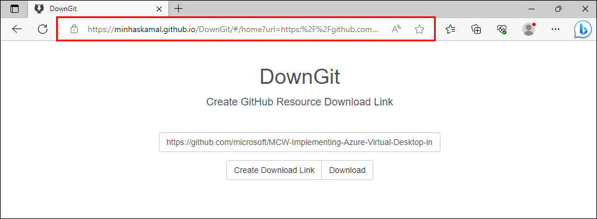
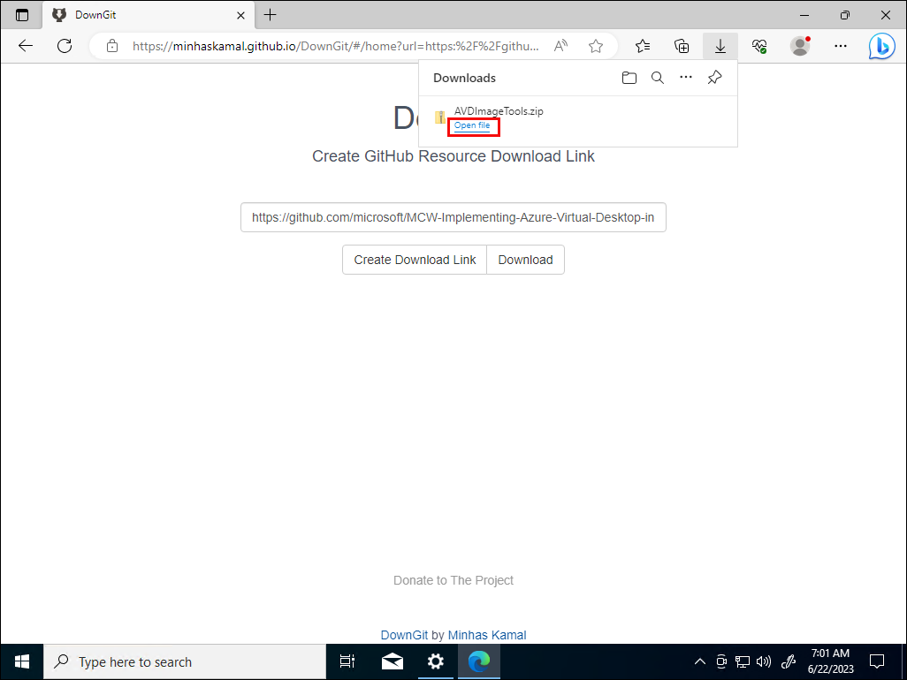
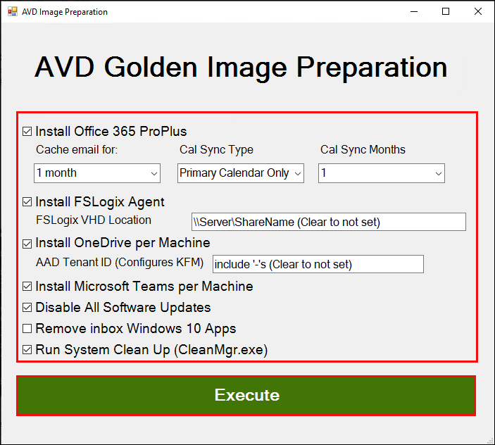
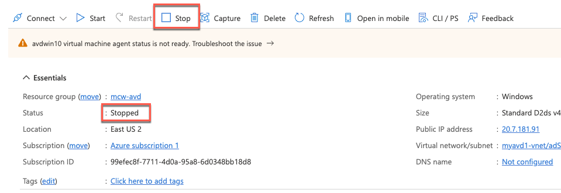
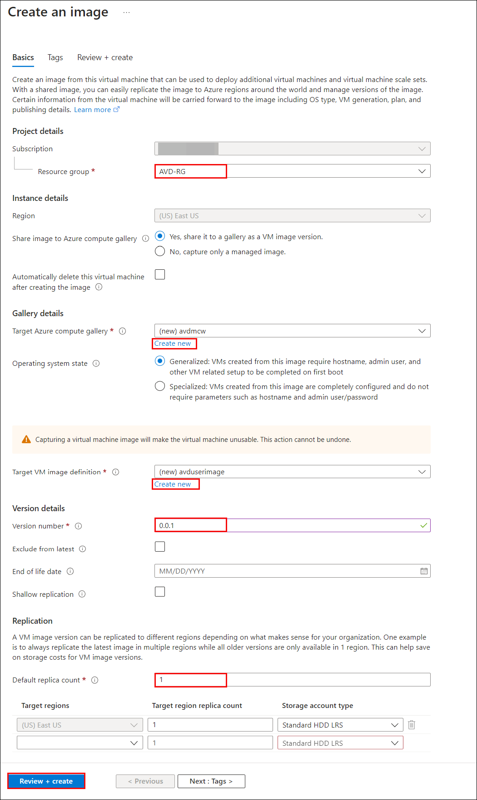

## Exercise 4: Create a gold image for AVD

Duration:  90 minutes

In this exercise, you are going to walk through the process of creating a gold image for your AVD host pools. The basic concept for a gold image is to start with a clean base install of Windows and layer on mandatory updates, applications, and configurations. There are many ways to create and manage images for AVD. The steps covered in this exercise are going to walk you through a basic build and capture process that includes core applications and recommended configuration options for AVD.

**Additional Resources**

  |              |            |  
|----------|:-------------:|
| Description | Links |
| Create a managed image of a generalized VM in Azure | https://docs.microsoft.com/en-us/azure/virtual-machines/windows/capture-image-resource |
  |   For more information on how to deploy a virtual machine in Azure |https://docs.microsoft.com/en-us/azure/virtual-machines/windows/quick-create-portal |
For more information on how to setup a Bastion host in Azure|https://docs.microsoft.com/en-us/azure/bastion/bastion-create-host-portal|
  |              |            | 


### Task 1: Create a new Virtual Machine (VM) in Azure

1. On the Azure portal home page, select **Create a resource**.

2. On the New page, search for **Microsoft Windows 10**. Select **Windows 10 Enterprise multi-session, Version 22H2** and **Create**.

    

   >**Note**: In this exercise, we are selecting a base Windows 10 image to start with and installing Office 365 ProPlus using a custom deployment script. We are also using the latest available release of Windows 10 Enterprise multi-session, but you can choose the version based on your requirements.

3. On the Create a virtual machine page, fill in the required fields and create the VM by selecting **Review + create** and then **Create**.

    - Resource group: **AVD-RG**.
    - Virtual machine name: **avdwin10**.
    - Region: **East US**, this should be the same as the location of your resource group.
    - Security Type: **Standard**.
    - Size: **Standard_D2s_V3**.
    - Username: **ADAdmin**.
    - Password: <inject key="AzureAdUserPassword" />

        

        >**Note**: Make a note of the **Username** and **Password** used to create the VM. This information will be required to access the VM after creation.

        >**Note**: This guide does not walk through the process of creating a VM in Azure. However, for **Inbound port rules**, be sure to allow **RDP (3389)**, or have a bastion host deployed for remote access.

        

4. Select the checkbox to confirm eligible Windows 10 licensing and create the VM by selecting **Review + create**.

    


5. Once the VM is successfully deployed, go to the resource, and connect using RDP. Sign in using the credentials you supplied when creating the VM.

    

6. Download the RDP file and open the RDP file to connect.

    

### Task 2: Run Windows Update

Despite the Azure support teams best efforts, the Marketplace images are not always up to date. The best and most secure practice is to keep your gold image up to date.

1. From your gold image VM, open the **Settings** app and select **Updates & Security**.

    

2. Install all missing updates, rebooting as necessary.

3. Once the VM is fully patched, the Windows Update Settings page should resemble the following screenshot.

    

### Task 3: Prepare an AVD image

**Introduction to the script**

The authors for this content have developed a scripted solution to assist in automating some common baseline image build tasks. The script includes a UI form, enabling you to quickly select which actions to perform. The result will be a custom gold image that incorporates Microsoft's main business applications, along with the necessary
policies and settings for an optimized user experience.

The script and related tools are maintained within this GitHub repo at https://github.com/microsoft//MCW-Implementing-Azure-Virtual-Desktop-in-the-enterprise/tree/main/Hands-on%20lab/resources/AVDImageTools. This is based on the tools available from https://github.com/shawntmeyer/WVD/tree/master/Image-Build/Customizations.

[Download Link](https://minhaskamal.github.io/DownGit/#/home?url=https://github.com/microsoft/MCW-Implementing-Azure-Virtual-Desktop-in-the-enterprise/tree/main/Hands-on%20lab/resources/AVDImageTools) 

https://minhaskamal.github.io/DownGit/#/home?url=https://github.com/microsoft/MCW-Implementing-Azure-Virtual-Desktop-in-the-enterprise/tree/main/Hands-on%20lab/resources/AVDImageTools


For additional documentation about the script (e.g., parameters, functions, etc.), refer to the comments in **Prepare-WVDImage.ps1**.

For troubleshooting script execution, refer to the following log directory on the target machine: **C:\\Windows\\Logs\\ImagePrep**.

This script leverages the [Local Group Policy Object (LGPO)](https://docs.microsoft.com/en-us/windows/security/threat-protection/security-compliance-toolkit-10#what-is-the-local-group-policy-object-lgpo-tool) tool in the [Microsoft Security Compliance Toolkit (SCT)](https://docs.microsoft.com/en-us/windows/security/threat-protection/security-compliance-toolkit-10) to apply settings in the image. The settings are documented and exported on the target machine under **C:\\Windows\\Logs\\ImagePrep\\LGPO**. This approach was taken to simplify troubleshooting, enabling you to leverage Group Policy Results.

The UI form offers the following actions:

**Office 365 ProPlus**

- Install the **latest** version of Microsoft 365 Apps for Enterprise monthly channel.

- Apply recommended settings.

- Source documentation: [Install Office on a gold VHD image](https://docs.microsoft.com/en-us/azure/virtual-desktop/install-office-on-wvd-master-image).

**OneDrive for Business**

- Install the **latest** version of OneDrive for Business *per-machine*.

- Source documentation: [Install Office on a gold VHD image](https://docs.microsoft.com/en-us/azure/virtual-desktop/install-office-on-wvd-master-image).

**Microsoft Teams**

- Install the **latest** version of Microsoft Teams *per-machine*.

- Source documentation: [Use Microsoft Teams on Azure Virtual desktop](https://docs.microsoft.com/en-us/azure/virtual-desktop/teams-on-avd).

**FSLogix Profile Containers**

- Install the **latest** version of the FSLogix Agent.

- Apply recommended settings.

- Source documentation: [Download and Install FSLogix](https://docs.microsoft.com/en-us/FSLogix/install-ht).

**OS Settings**

- Apply the recommended AVD settings for image capture.

- Source documentation: [Prepare and customize a gold VHD image](https://docs.microsoft.com/en-us/azure/virtual-desktop/set-up-customize-master-image).

- Apply the recommended settings for capturing an Azure VM.

- Source documentation: [Prepare a Windows VHD or VHDX to upload to Azure](https://docs.microsoft.com/en-us/azure/virtual-machines/windows/prepare-for-upload-vhd-image). 

- Run Disk Cleanup.

- Source documentation: [cleanmgr](https://docs.microsoft.com/en-us/windows-server/administration/windows-commands/cleanmgr). 

**Running the script**

1. [**Download**](https://minhaskamal.github.io/DownGit/#/home?url=https://github.com/microsoft/MCW-Implementing-Azure-Virtual-Desktop-in-the-enterprise/tree/main/Hands-on%20lab/resources/AVDImageTools) the .zip file to your local workstation.

    https://minhaskamal.github.io/DownGit/#/home?url=https://github.com/microsoft/MCW-Implementing-Azure-Virtual-Desktop-in-the-enterprise/tree/main/Hands-on%20lab/resources/AVDImageTools

    

2. **Open** the .zip file on your local workstation. Open the RDP window to your gold image VM. **Save as** the .zip file to the documents folder.

    

3. On the gold image VM, right-click on the .zip file on your desktop and select **Extract All\...**.

    

4. Extract the files to **C:\AVDGold**.

5. Open an elevated PowerShell window by searching for PowerShell on the Windows 10 VM. Right-click and run as administrator.

    

6. Navigate to "C:\AVDGold\AVDImageTools\Prepare-AVDImage".

    ```
    cd C:\AVDGold\AVDImageTools\Prepare-AVDImage
    ```

7. Run the following command to allow for script execution:

    ```
    Set-ExecutionPolicy -ExecutionPolicy Bypass -Scope Process -Force
    ```

8. Execute the script by running the following command:

    ```
    .\Prepare-AVDImage.ps1 -DisplayForm
    ```

      

This will trigger the PowerShell form to launch. Select the appropriate options based on the following input information.

  

  - Select **Install Office 365** to Install Microsoft 365 Apps for enterprise while excluding Teams, Groove, and Skype. This will enable the Email and Calendar Caching settings below.

    > **Note**: Update these settings as necessary. The Microsoft recommended settings are pre-selected. When you do not wish to apply these settings to the image, set each to \'Not Configured\'.

  - Select **Install FSLogix Agent** to install the FSLogix Agent. When you select this option, the option to specify the FSLogix User Profile Container VHD Path is enabled. You do not want to specify this option in the image so blank out this setting.

  - Select **Install OneDrive per Machine** to install the OneDrive sync client per machine. When you select this option, it will enable the AAD Tenant ID field. Enter your tenant id here to enable silent Known Folder Move functionality in your image. We don't want this in our image for this lab, so blank out this setting as well.

  - Select **Install Microsoft Teams per Machine** to install the per machine Teams install.

  - Select **Install Microsoft Edge Enterprise+** to install the Microsoft Edge Enterprise browser based on Chromium.

  - Select **Disable Windows Update** to disable Windows Update in the image.

  - Clear **Remove inbox Windows 10 Apps**.

  - Select **Run System Clean Up (CleanMgr.exe)** to execute Disk Cleanup.
    
    

9. With the desired options selected, select **Execute**.

    The form will close at this point and the script will begin configuring the image. **DO NOT close any of the remaining windows that appear until the script has finished execution**. Doing so will interrupt the process and will require you to start over.

    The script will take several minutes to complete depending on the options you selected. Additional input from you is not required during this stage, so feel free to minimize the RDP session and work on other tasks.

    -   When you selected to install Office 365, you will see a setup.exe window during execution.

    -   When you selected to install OneDrive, you will see a OneDrive window during execution.

    -   When you selected to run System Clean Up, you will see the Disk Cleanup wizard during execution. This window may stay on the \"Windows Update Cleanup\" task for a few minutes while it cleans out older files in the Windows Side by Side.


      > **Note**: This script takes some time to run, so be patient as it may seem like nothing is happening for a while, and then applications will begin to install. You can watch the status from within PowerShell. After the Disk Cleanup Wizard closes, you may notice the PowerShell window does not update. It is waiting for the cleanmgr.exe process to close, which can take some time. You can select the PowerShell window and continue to hit the up arrow on your keyboard until you are presented with an active prompt.

    


10. As part of the script, you may be logged off, or the computer may reboot. If so, log back in and rerun the script. This time without OneDrive selected.

11. After the script has been completed, select the Window Start icon and note that Office and Microsoft Teams have been installed.

      

12. Once the script has completed execution, complete these final tasks:

     - Delete the C:\AVDGold directory from the computer.

     - Empty the Recycle Bin.

     - Copy the C:\\Windows\\Logs\\ImagePrep\\LGPO directory to your local workstation.

     - Reboot the VM.

     

     

### Task 4: Run Sysprep

1. After the VM has rebooted, reconnect your RDP session and sign in.

2. Open an administrative command prompt.

3. Navigate to: **C:\\Windows\\System32\\Sysprep**.

    ```
    cd C:\Windows\System32\Sysprep
    ```

4. Run the following command to sysprep the VM and shutdown:

    ```
    sysprep.exe /oobe /generalize /shutdown
    ``` 

The system will automatically shut down and disconnect your RDP session.

### Task 5: Create a managed image from the gold Image VM

1. Sign in to the [Azure Portal](https://portal.azure.com/).

2. At the top of the page, in the **Search resources** field, type **virtual machines**. Select **Virtual machines** from the list.

    

3. On the Virtual machines blade, select the VM **avdwin10** you used for your gold image and **select** the name.

4. On the Overview blade for your VM, confirm the **Status** shows **Stopped**. Select **Stop** in the menu bar to move it to a deallocated state.

    

    

5. Once complete, select **Capture** in the menu bar.

    

6. On the Create image wizard, fill in the required fields and Select **Review + create** then select **Create**.

    - Resource Group: *Select **AVD-RG** from the drop down*.
    - Target image gallery: Create a new, name as **avdmcw**, and click on **ok**.
    - Target image definition: Create a new, name as **avduserimage**, and click on **ok**.
    - Version number: **0.0.1**.
    - Default replication count: **1**.   

    

7. Once complete, type **VM image definitions** in the **Search resources field** at the top of the page. Select **VM image definitions** from the list.

8. Locate your image and **Select** the name.

    

9. On the Overview blade for your image, make note of the **Name** field and **Resource group** field. These attributes are needed when you provision your host pools.

    

### Task 6: Provision a Host Pool with a custom image

1.  To start provisioning a host pool with your custom image, follow the instructions in [Exercise 6](#exercise-6-create-a-host-pool-and-assign-pooled-remote-apps).

2.  When you get to step 5 to configure **Virtual machine settings**, select **Browse all images and disks** and then select the tab option for **My Items** to select the image that was created.

    

3. Click on the **Next** button present in the bottom-right corner of this lab guide.

