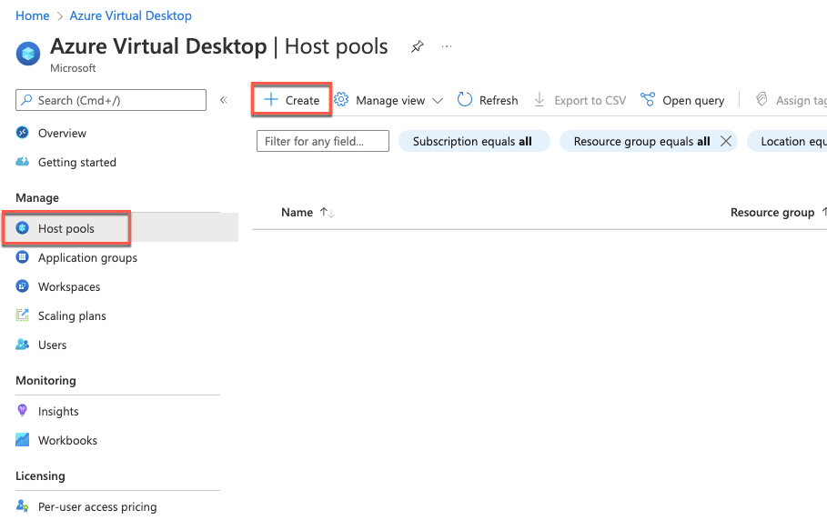
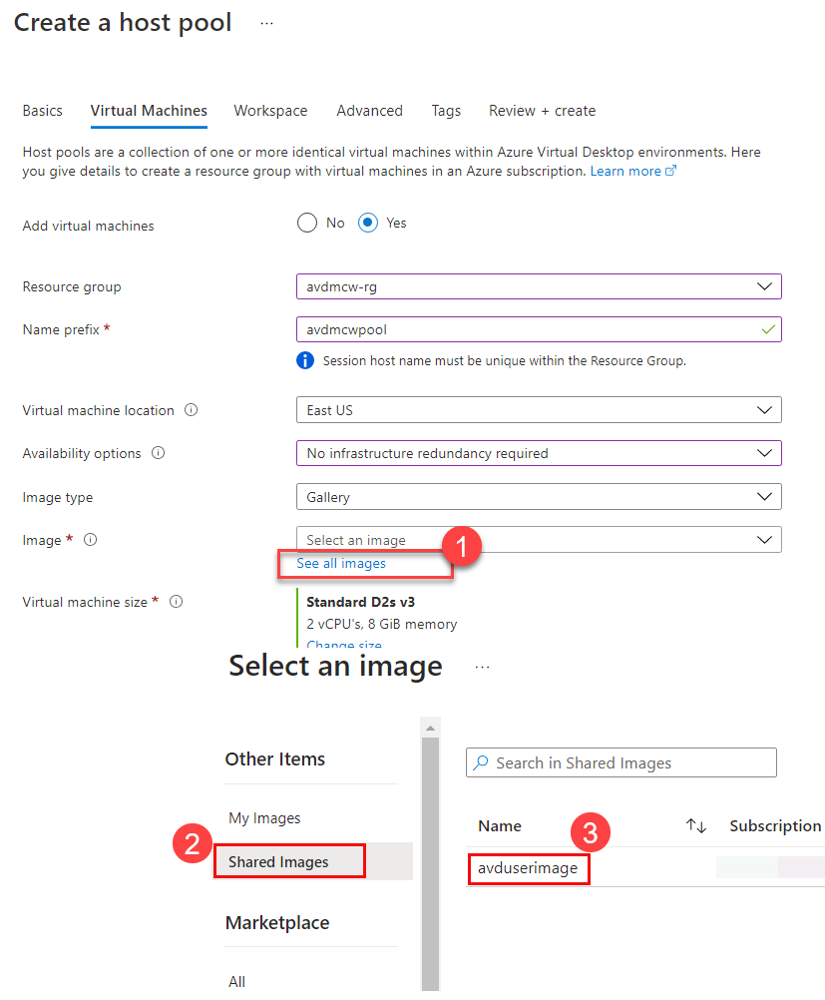
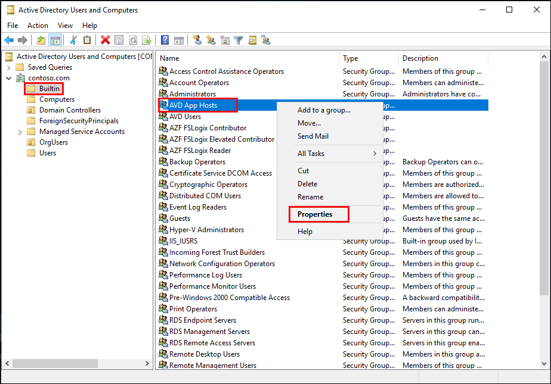
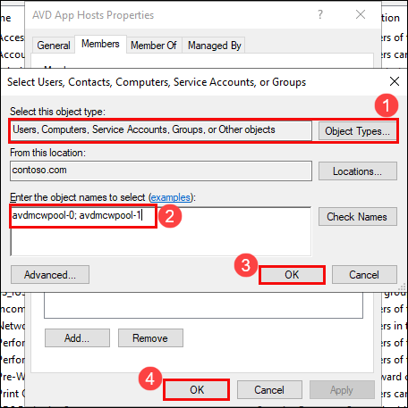
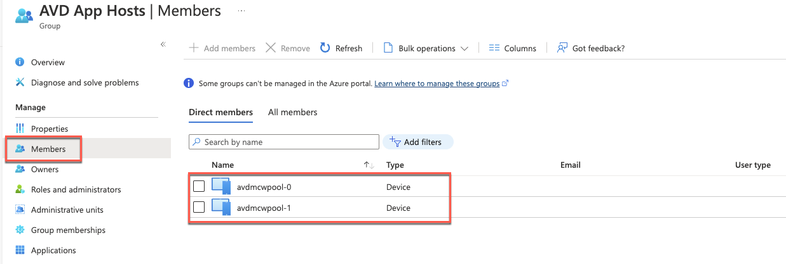
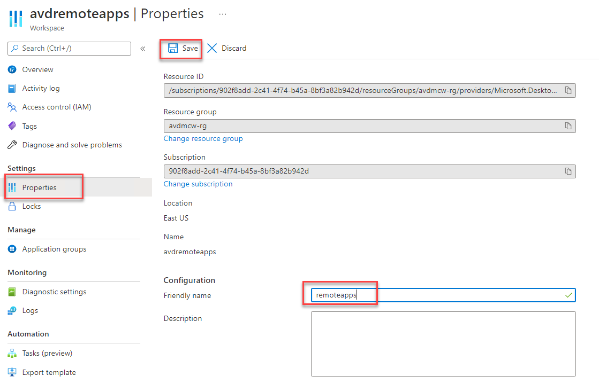
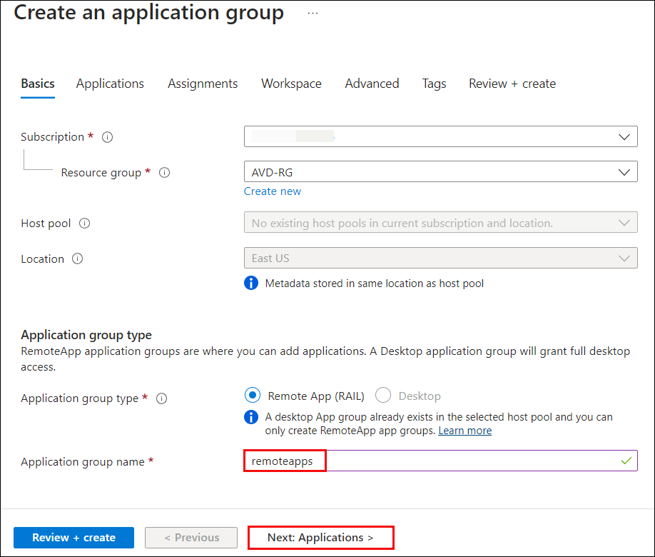
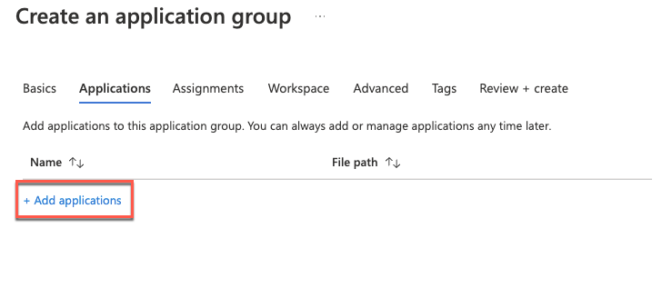
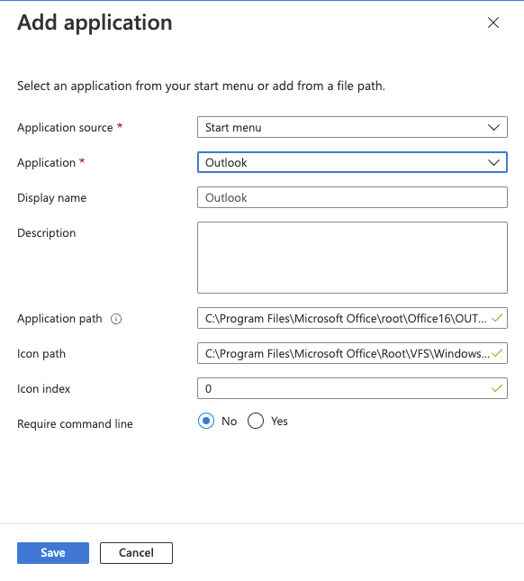
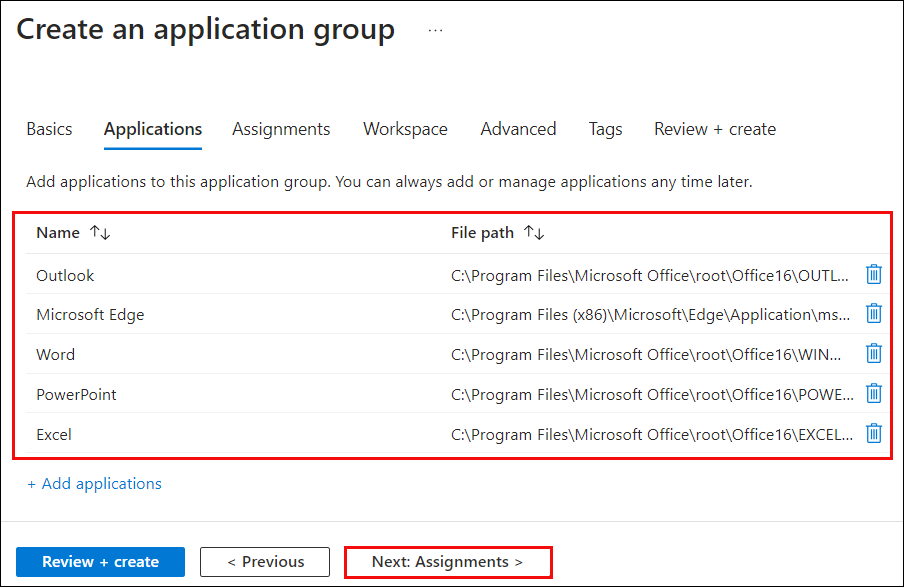

## Exercise 6: Create a host pool and assign pooled remote apps.

Duration:  45 minutes

In this exercise, you will be creating a non-persistent host pool for publishing remote apps. This enables you to assign users access to specific applications rather than an entire desktop. This type of application deployment serves many purposes and is not new to AVD, but has existed in Windows Server Remote Desktop Services for many years.

**Additional Resources**

  |              |            |  
|----------|:-------------:|
| Description | Links |
| Publish built-in apps in Azure Virtual Desktop | https://docs.microsoft.com/en-us/azure/virtual-desktop/publish-apps |
| Manage app groups with the Azure portal | https://docs.microsoft.com/en-us/azure/virtual-desktop/manage-app-groups |
  |              |            | 

### Task 1: Create a new host pool and workspace

1.  Sign in to the [Azure Portal](https://portal.azure.com/).

2.  Search for **Azure Virtual Desktop** and select it from the list.

    

3.  Under Manage, select **Host pools** and select **+ Create**.

    

4.  On the Basics page, refer to the following screenshot to fill in the required fields and change **Validation environment** to **Yes**. Selecting **Pooled** for host pool type. Once complete, select **Next: Virtual Machine**.

    

5.  When you configure **Virtual machine settings**, select **Browse all images and disks** and then select the tab option for **My Items** to select the image that was created earlier in **Exercise 4**.

    

    >**Note**: Selecting this image is very important. You will need the Microsoft 365 for assigning apps in this exercise.

6. Now, enter the rest of the settings for your host pool.

    - Add Azure virtual machines: Yes
    - Name prefix: avdmcwpool (or anything else you prefer).
    - Virtual machine location: The region you've been creating your AVD host VMs.
    - Availability options: Non infrastructure redundancy required.
    - Image: Your custom Windows Image. It should be something similar to "avdmcw/avduserimage/1.0.0".
    - Number of VMs: 2
    - Virtual Netwokr: The virtual network you created for your host VMs.
    - AD domain join UPN: adamin@yourdomain.com, replacing yourdomain.com with the domain you chose to use for the lab.
    - Password: the password you set for you adadmin user.
    - Username: avdadmin
    - Password: The password you want to use for your avdadmin user.
    - Confirm passwrd: Re-enter the password you want to use for your avdadmin user.

      

7. On the Workspace page, select **Yes** to register a new desktop app group. Select **Create new** and provide a **Workspace name**. Select **OK** and **Review + create**.

    

8. On the Create a host pool page, select **Create**.

9. Once the virtual machines have been created, use remote desktop to connect back to your domain controller.

10. Open up **Active Directory Users and Computers** and find the **AVD App Hosts** security group we created earlier and switch to the **Members** tab.

    

    

12. Select **Add..**

    - Add **computers** to the **Object Types**.
    - Add the two virtual machines we just created. Then select **OK**.
    - Select **OK**
    - Select **OK**

    

13. Wait a few minutes and make sure this change synchronizes to Azure Active Directory.

    

14. Reboot both of the virtual machines.

### Task 2: Create a friendly name for the workspace

The name of the Workspace is displayed when the user signs in. Available resources are organized by Workspace. For a better user experience, we will provide a friendly name for our new Workspace.

1.  Sign in to the [Azure Portal](https://portal.azure.com/).

2.  Search for **Azure Virtual Desktop** and select it from the list.

    

3.  Under Manage, select **Workspaces**. Locate the Workspace that was created for remote apps and select the name.

    

4.  Under Settings, select **Properties**.

5.  Update the **Friendly name** field to your desired name.

    

6.  Select **Save**.

    

### Task 3: Add Remote Apps to your Host Pool

1.  Sign in to the [Azure Portal](https://portal.azure.com/).

2.  Search for **Azure Virtual Desktop** and select it from the list.

3.  Under Manage, select **Host pools** and select the host pool that you created in Task 1.  Select **Application groups** and select **Add** to create a new application group.
   
    

4.  In the Basics tab, name the application group 
   
    

5. Select **Next: Applications**.

6. On the Applications page, select **+ Add Application**.

    

7. On the Add Application fly out, next to Application source, select **Start Menu**. Next, add the following applications, selecting **Save** between selections.

    - Outlook

    - Microsoft Edge

    - Word

    - PowerPoint

    - Excel

    

    

8. Select **Next: Assignments**.

9. On the assignments tab, select **Add assignments**, search for the **AVD Remote App All Users** created earlier in this guide, and choose **Select**.

    

    >**Note**: AAD DC Administrators will allow you to use your Azure tenant login to access resources in Exercise 7.

10.  Select **Next: Workspace**.

11. On the Workspace page, select **Yes** to register the application group.

    >**Note**: The **Register application group** field will automatically populate with the workspace name.

12. Select **Review + Create**.

    

13. Select **Create**.

You have successfully created a Remote App non-persistent Host Pool with published apps. You can validate this configuration when you connect to the environment in a later exercise.
