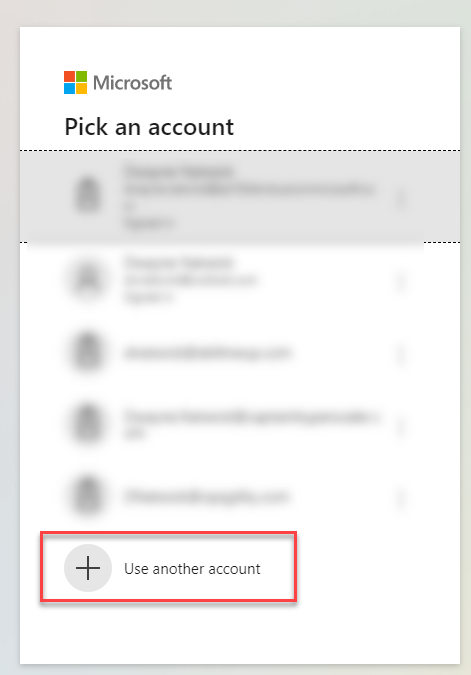
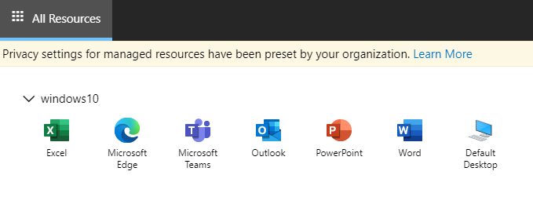

## Exercise 7: Connect to AVD with the web client

Duration:  30 minutes

In this exercise, you are going to walk through connecting to your AVD environment using the HTML5 web client and validating your deployment. The following operating systems and browsers are supported:

**Additional Resources**

There are multiple clients available for you to access AVD resources. Refer to the following Docs for more information about each client:

|----------|:-------------:|
| Description | Links |
| Connect with the Windows Desktop Client |  https://docs.microsoft.com/en-us/azure/virtual-desktop/connect-windows-7-and-10 |
| Connect with the HTML5 web client |  https://docs.microsoft.com/en-us/azure/virtual-desktop/connect-web |
| Connect with the Android client | https://docs.microsoft.com/en-us/azure/virtual-desktop/connect-android |
| Connect with the macOS client |  https://docs.microsoft.com/en-us/azure/virtual-desktop/connect-macos |
| Connect with the iOS client | https://docs.microsoft.com/en-us/azure/virtual-desktop/connect-ios |

### Task 1: Connecting with the HTML5 web client

1.  Open a supported web browser.

2.  Navigate to the https://rdweb.wvd.microsoft.com/arm/webclient.

    >**Note**: You will be asked to login when you access the above URL.  The credentials that you use are those from the lab.

3.  Sign in using a synchronized identity that has been assigned to an application group.

    >**Note**: When you added the **AAD DC Administrators** to the groups in the previous exercises, you will be able to use your Global Administrator information.  This **must** be a user that is synchronized with the AD DS with Azure AD Connect.  To verify, go to Azure Active Directory users and verify the directory sync users.

    

    

    

    

4.  Select an available resource from the web client. In this example we will connect to a host pool containing pooled desktop.

    

5.  On the **Access local resources** prompt, review the available options for and select **Allow**.

    

6.  On the **Enter your credentials** prompt, sign in using the same account from Step 3 and select **Submit**. 
   
    >**Note**: The username and password to login to the AVD desktop will be credentials from the domain controller username and password created upon initial deployment.  When you need the user email, RDP into the domain controller VM and find the user in the **Active Directory Users and Groups** and **OrgUsers**.

    

    

7.  Once connected, validate the components relative to your configuration. The desktop should show icons for Microsoft Edge and Microsoft Teams.  When you go to the Windows start menu, you can find the Office applications.

    

**Troubleshooting**

**Web client stops responding or disconnects**

Try connecting using another browser or client.

If issues continue even after you\'ve switched browsers, the problem may not be with your browser, but with your network. We recommend you contact network support.

**Web client keeps prompting for credentials**

If the Web client keeps prompting for credentials, follow these instructions:

1.  Confirm the web client URL is correct.

2.  Confirm that the credentials you\'re using are for the Azure Virtual Desktop environment tied to the URL.

3.  Clear browser cookies.

4.  Clear browser cache.

5.  Open your browser in Private mode.
