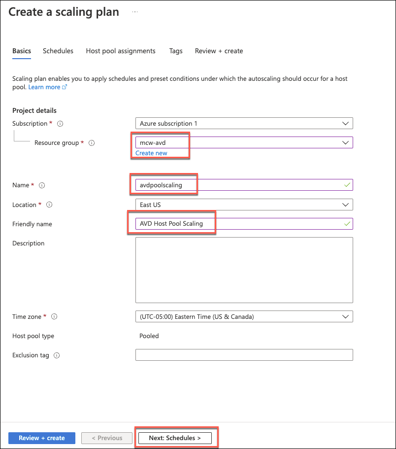
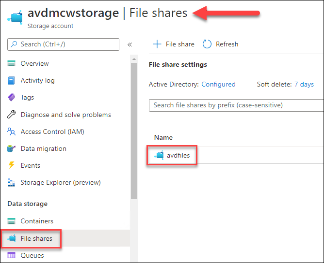
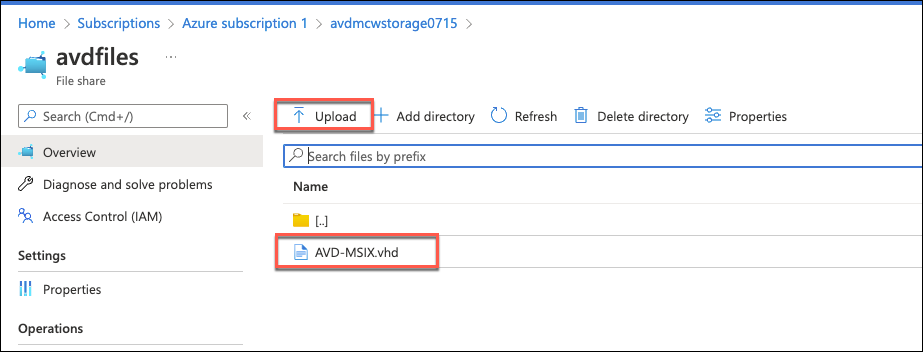
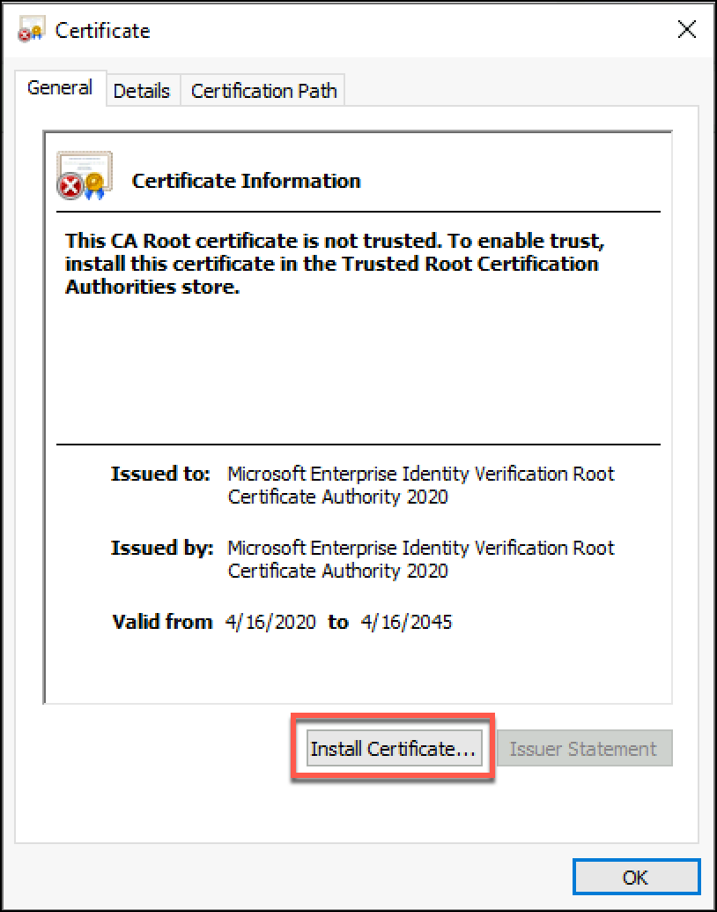
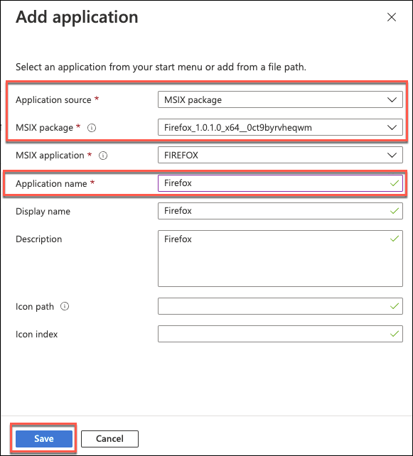

## Exercise 9: Improving your AVD environment

Duration:  60 minutes

In this exercise, you will our AVD experience bay utilizing additional features or tools with the host pools. AVD is designed to be a versatile platform to distribute and build your solution from, and these optional features allow you to enhance and/or secure the environment depending on your needs. By the end of this exercise, you will have the following features enabled:

- Autoscale pooled pool based on connections

- Centralized Application Management (MSIX App Attach)

- Protect your environment via Microsoft Defender for Endpoint


**Additional Resources**

| Description | Links |
|----------|:-------------:|
| Scale session hosts using Azure Automation | https://docs.microsoft.com/en-us/azure/virtual-desktop/set-up-scaling-script |
| Set up MSIX app attach with the Azure portal |  https://docs.microsoft.com/en-us/azure/virtual-desktop/app-attach-azure-portal |
| Prepare an MSIX image for Azure Virtual Desktop | https://docs.microsoft.com/en-us/azure/virtual-desktop/app-attach-image-prep |
| MSIX Packaging Tool | https://docs.microsoft.com/en-us/windows/msix/packaging-tool/tool-overview |
| Onboard Windows 10 multi-session devices in Windows Virtual Desktop | https://docs.microsoft.com/en-us/microsoft-365/security/defender-endpoint/Onboard-Windows-10-multi-session-device?view=o365-worldwide |
| Azure Cloud Shell | https://docs.microsoft.com/en-us/azure/cloud-shell/overview |

11. Select **Review + assign**, then **Create**

### Task 2: Enabling Autoscale

In this task, you will enable the scaling of your pool based on the number of connections. Azure Virtual Desktop allows you to create scaling plans which will enable us to automatically increase and decrease the number of hosts in an AVD host pool based on the demand of the environment.

1. Navigate to the Azure Portal and go to Azure Virtual Desktop.

2. Select **Scaling plans** under **Manage**, then select **Create scaling plan**.

    

3. Select the resource group and location for Azure Virtual Desktop. Then give your scaling plan a friendly name and select **Next: Schedules >**.

    

4. Select **+ Add schedule**. Keep the defaults in General and select **Next**.

    

5. Within Ramp-up, review the settings, but we'll take the default settings again. Start time entails two things, the start of when you start to power on VMs and the end time of off-peak hours. Minimum is the minimum percentage of VMs that should be powered on starting at this time. The capacity threshold is what percentage of capacity needs to be used before another virtual machine is powered on. For example, with a pool of 10 VMs and a capacity of 20 sessions, at 8:00 am, a minimum of two VMs would be on. Once you get to 12 active sessions, a 3rd virtual machine will be powered on. Select **Next**.

    

6. Peak hours is another one we won't make any changes to, but review the settings. The minimum number of VMs turned on will carry over from ramp-up as well as the capacity threshold.

    

7. Ramp down is the time you want to start shutting down virtual machines and is the end of peak hours. Here the minimum percentage of hosts should be smaller than ramp-up and peak hours as you want to start shutting down virtual machines. The default is 10 percent, meaning in a pool of 10 virtual machines, you want to leave no less than 1 VM powered on. The capacity threshold will turn virtual machines on if you hit it, but this should be a larger number, so you aren't powering on virtual machines as you try to ramp down. The final set of settings is around logging users out. To shut down virtual machines, users need to log off and shift their sessions to other hosts. These settings allow you to configure if the user logout is forced, how long after they log out the machine is shut down, and the message given to users. Leave all settings the default and select **Next**.

    

8. Off-peak hours is the time that ramp-down will end and will also take the capacity threshold from the ramp-down settings. This capacity threshold takes the higher value from ramp-down as you don't want machines powered on during off-peak hours unless necessary. The off-peak hours will end when the next ramp-up time starts. Select **Add**.

    

9. You'll see your new schedule added to the scaling plan schedule. Select **Next: Host pool assignments >**.

    

10. Select your load balanced host pool in the drop-down, ensure **Enable autoscale** is selected, select **Review + create**, then select **Create**.

    

At this point, your AVD Host Pool that is Pooled will spin up and down hosts based on the environment's load.

### Task 2: Utilizing Application Packages (MSIX)

In this task, you will take an **MSIX package** created from the [MSIX packaging tool](https://docs.microsoft.com/en-us/windows/msix/packaging-tool/tool-overview) and utilize the Azure portal to attach the MSIX package dynamically to AVD pools as users log in. MSIX Packages are disk images containing all files, configurations, and publication details needed to run supported applications that can be mounted by Windows systems on the fly to allow users to run the application without having to install the application on the host machine. By utilizing this technique, we can minimize the footprint and management needs of the AVD hosts while still using multiple applications on the systems without installing the applications permanently on the system.

1. Go to the [Azure Portal](https://portal.azure.com/).

    

2. Go to the **Storage Account** created in Exercise 3 for the FSLogix profiles already joined to Active Directory.

3. Select the **File shares** under data storage and select the share created for AVD files.

    

4. Ensure the **MSIX** directory you created earlier is there; if not, go back to Exercise 3, Tasks 4-6 and follow the steps to create it.

    >**Note:** Normally, in production, you would create an additional share for MSIX files and place the files there. You would need to make sure the share or container the MSIX files are in you follow the same steps you use for the FSLogix storage account and apply the appropriate permissions to them (users typically only need Read access) and make sure there is enough room to store them. We are placing it on the same share for this exercise for expediency and easier setup. It is not uncommon to have a central MSIX storage with permissions to each MSIX file based on groups assigned to the appropriate application and the MSIX repository used by multiple pools or deployments but ensure network connectivity and speed are kept consistent.

5. In a new tab in your browser, navigate to [https://github.com/microsoft/MCW-Implementing-Azure-Virtual-Desktop-in-the-enterprise/blob/main/Hands-on%20lab/resources/VHD/](https://github.com/microsoft/MCW-Implementing-Azure-Virtual-Desktop-in-the-enterprise/blob/main/Hands-on%20lab/resources/VHD/) and download AVD-MSIX.vhd.

6. Back in your storage account, upload the .VHD file to the MSIX folder.

    

7. The MSIX images on the VHD have been signed with Device Guard v2; for it to work, the root certificate needs to be installed on the servers used for publishing the apps. These servers don't have a public IP address, so we'll use the domain controller as a jump box to the app servers. First, create a remote desktop session to the domain controller.

8. Get the IP address from the first server in your remote app pool. It should be something like 10.1.0.8.

    

9. On the domain controller, open Remote Desktop Connection and connect to the IP address of your first remote app server. You can use the avdadmin account you set up as a local admin when creating the server by entering **/avdadmin** for the username.

    

10. Once you're logged into the first app server, open up Microsoft Edge and navigate to the following URL:

    ```text
    https://www.microsoft.com/pkiops/certs/microsoft%20enterprise%20identity%20verification%20root%20certificate%20authority%202020.crt
    ```

11. Open the downloaded certificate; this root certificate is needed to verify the MSIX packages. Select **Open** when the Security Warning is shown.

    

    

12. With the certificate opened, select **Install Certificate...**.

    

13. In the Certificate Import Wizard, select **Local Machine** for the Store Location. Then select **Next**.

    

14. On the wizard's next step, select **Place all certificates in the following store**. Then select **Browser** and **Trusted Root Certification Authorities**. Select **Next**.

    

15. Select **Finish**, and you'll see a dialog that the import was completed successfully.

    

    

16. Restart virtual machine. Repeat steps 8 - 16 on the second remote app server in the pool to import the certificate there also.

    >**Note**: In a larger image, this certificate import could be done in the Gold Image used for provisioning machines or incorporated into the provisioning of any new app servers in the pool.

17. Once the certificate has been successfully imported into both remote app servers and they have both been rebooted, navigate back to **Azure Virtual Desktop** in the Azure portal.

18. Select **Host Pools**, your remote app pool, **MSIX packages**, and then **+ Add**.

    

19. In the MSIX image path, paste the file share path to your MSIX file. It should be in the format below. After pasting it in, wait a few seconds, and the rest of the dialog boxes should appear.

    ```text
    \\<storage account name>.file.core.windows.net\<share name>\msix\AVD-MSIX.vhd.
    ```

20. Select **Firefox** in the MSIX package, type **Firefox** into the Display Name, and set the State to **Active**. Then select **Add**.

    

21. Repeat steps 19 and 20 to add the NotePad++ package using the same path to the .vhd file and configure the settings for Notepad++ with the following settings.

    - MSIX image path: the path to the network share containing you .vhd file. The same path from step 19.
    - MSIX package: Select your NotepadPlusPlus package from the dropdown
    - Display name: Notepad++
    - State: Active

    

22. In **Azure Virtual Desktop**, select **Application groups** under Manage, then select your **remoteapps** group.

23. Within your **remoteapps** group, select **Applications** and **+Add**.

    

24. Set the Application source to **MSIX package**, select **Firefox**, and provide an Application name of **Firefox**. Select Save.

    

25. Repeat steps 23 and 24 to add the Notepad++ application.

26. You should have Firefox and Notepad++ added as available applications now.

    

27. Go to the [AVD Web Client](https://rdweb.wvd.microsoft.com/arm/webclient) (or AVD client if installed locally) and login as one of your end users.

28. Select the new application icon to launch the application (refresh the page if the new application does not show up).

    

This application is now running on the host pool, although it is not installed on the host system. This allows the application to be updated by changing which MSIX package the application points to and the next time a user logs into the application.

### Task 3: Protect AVD with Microsoft Defender for Endpoint

In this task, you will enable Microsoft Defender for Endpoint service and deploy the endpoint protection via Azure. This enables all systems to be protected by the Microsoft Defender for Endpoint service from potential vulnerabilities and alerts in the event of suspicious execution or activity.

>**Note:** This will require signing up for [Azure Defender trial](https://docs.microsoft.com/en-us/azure/security-center/enable-azure-defender#to-enable-azure-defender-on-your-subscriptions-and-workspaces) on your subscription. If this is a Visual Studio subscription or you do not want to sign up for the time trial yet, you will need to wait and deploy this when you can sign up for the Azure Defender trial.

1. Go to the [Azure Portal](https://portal.azure.com/).

    

2. Open **Microsoft Defender for Cloud**.

    

3. Select **Upgrade** on the **Getting started** page.

    

4. Go to the **Workload protections** under the Cloud Security section.

5. Select **Enable Microsoft Defender for Cloud** to set up the trial edition of Azure Defender for your subscription.

    

6. Select Upgrade to start the 30-day trial upgrade you skipped earlier. You could also have upgraded from the initial Getting Started page.

    

7. Select **Install agents** to deploy the security agents to your virtual machines. You'll also see the count of unprotected resources in the entire subscription.

    

8. Refresh the **Workload protections** screen. At the top, you should see all your resources in the subscription now fully covered.

    

9. It can take some time for agents to deploy fully, but if you let it run for a while, you'll start seeing your resources show up in the Inventory.

    

10. Depending on your AVD environment, you can deploy them to systems as they are added to your domain in the AVD OU by utilizing Group Policies using the [domain group policy scenario](https://docs.microsoft.com/en-us/microsoft-365/security/defender-endpoint/onboard-windows-10-multi-session-device?view=o365-worldwide#scenario-2-using-domain-group-policy). Another option when your host is not persistent or deployed from an image, is to use the instructions for [onboarding non-persistent VDI devices](https://docs.microsoft.com/en-us/microsoft-365/security/defender-endpoint/configure-endpoints-vdi?view=o365-worldwide).
 
